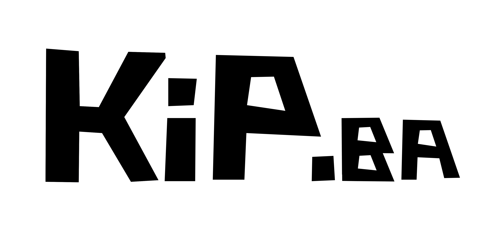
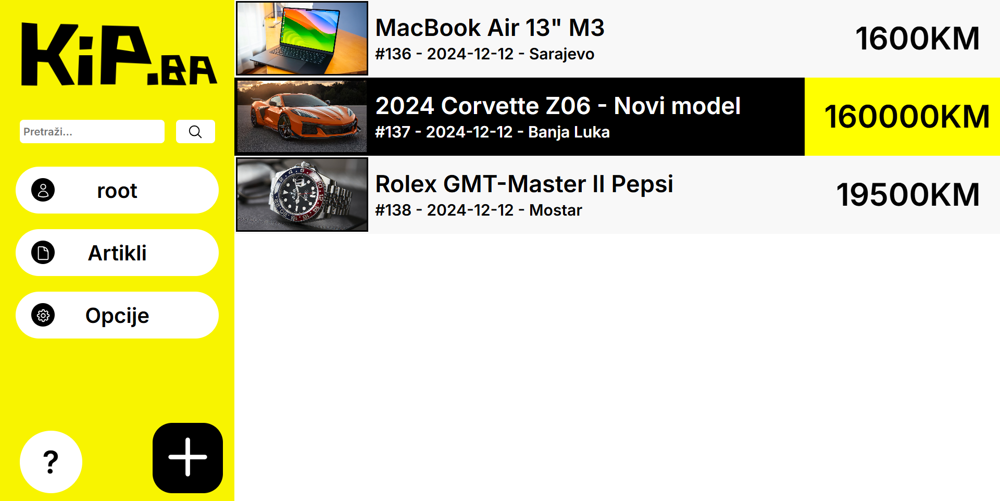
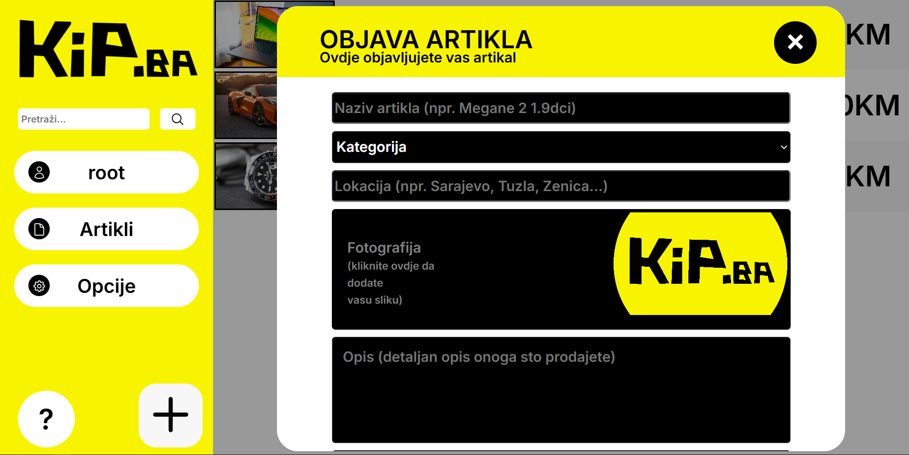
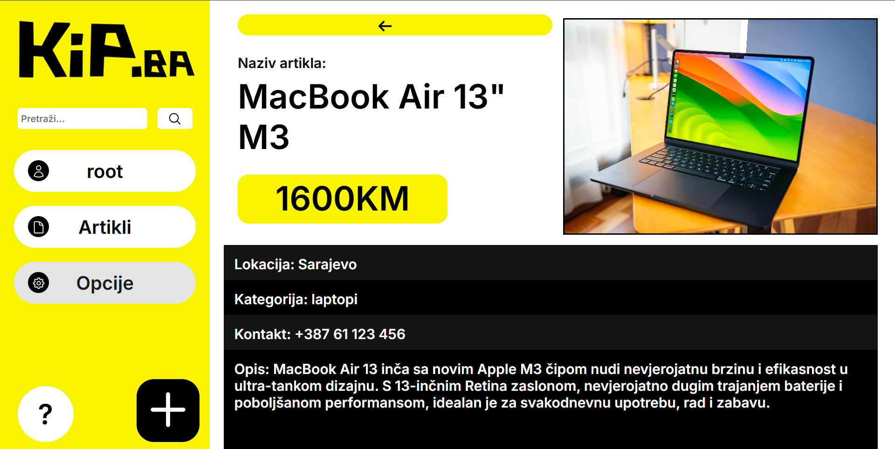

**⚠️ Disclaimer:** This is an **old project** created in 2022. It was developed for learning and experimentation purposes and is no longer actively maintained.
# KiP.ba



Welcome to **KiP.ba**, a marketplace website project created in 2022! This was an experimental project designed to showcase my skills in web development using PHP, MySQL, HTML, CSS, and JavaScript. The website simulates a platform for users to buy and sell products.

---

## Features

- **Dynamic Marketplace:** Users can browse, add, and manage product listings.
- **User Accounts:** Basic user authentication and profile management.
- **Database Integration:** All product and user data is stored and managed in an SQL database.
- **Interactive Design:** Utilizes JavaScript for dynamic interactions and enhanced user experience.
- **Responsive Frontend:** Designed with HTML and CSS for a clean and user-friendly interface.

---

## Technologies Used

- **Backend:** PHP (served locally using XAMPP).
- **Database:** MySQL for storing user and product data.
- **Frontend:** HTML, CSS, and JavaScript.
- **Server Environment:** XAMPP for local development and testing.

---

## Installation and Setup

1. **Install XAMPP:** Download and install [XAMPP](https://www.apachefriends.org/index.html) to serve the project locally.
2. **Clone the Repository:**
   ```bash
   git clone https://github.com/harunridjevic/kip.ba
   cd kip.ba
   ```
3. **Set Up the Database:**
   - Import the provided SQL file into your local MySQL server.
   - Configure the database credentials in the `db\_config.php` file.
4. **Start XAMPP:**
   - Start Apache and MySQL services in the XAMPP control panel.
   - Place the project files in the `htdocs` folder of your XAMPP installation.
5. **Access the Website:** Open your browser and navigate to `http://localhost/kip.ba`.

---

## Screenshots

Homepage:




Creating an article:




Viewing an article:




---

## Project Structure

```
kip.ba/
├── css/                # Stylesheets
├── db/                 # Database files
├── img/                # Article images
├── logo/               # Site logo images
├── pages/              # Page files
├── screenshots/        # Website screenshots
├── index.php           # Login page
└── README.md           # Documentation
```

---

## Future Improvements

While this project was a great learning experience, there are areas for improvement:

- Enhance user authentication (e.g., password hashing, email verification).
- Add advanced search and filtering options.
- Improve the design with a modern CSS framework like Tailwind or Bootstrap.

---

## Acknowledgements

Thanks to all the resources and tutorials that helped shape this project. KiP.ba reflects my early steps into full-stack development.

---

## License

This project is licensed under the MIT License. Feel free to use and modify it for your own learning and projects.

